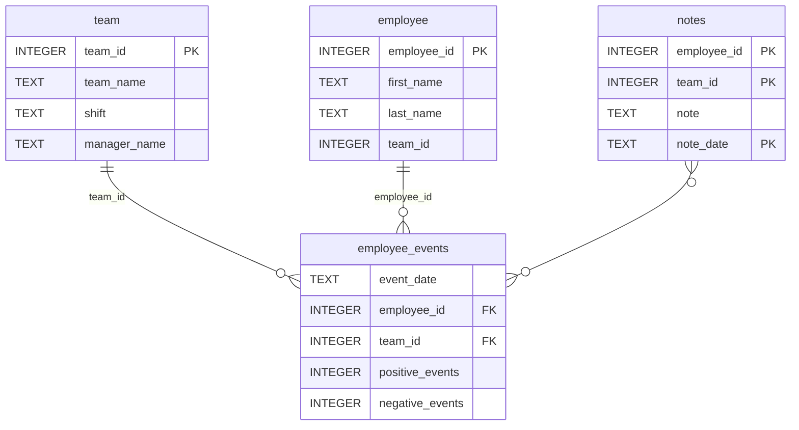

# Software Engineering for Data Scientists 

This repository contains starter code for the **Software Engineering for Data Scientists** final project. Please reference your course materials for documentation on this repository's structure and important files. Happy coding!

## Repository Structure
```
├── README.md
├── assets
│   ├── model.pkl
│   └── report.css
├── env
├── python-package
|   ├── dist/
|       ├── employee_events-0.0.tar.gz
│   ├── employee_events
│   │   ├── __init__.py
│   │   ├── employee.py
│   │   ├── employee_events.db
│   │   ├── query_base.py
│   │   ├── sql_execution.py
│   │   └── team.py
│   ├── requirements.txt
│   ├── setup.py
├── report
│   ├── base_components
│   │   ├── __init__.py
│   │   ├── base_component.py
│   │   ├── data_table.py
│   │   ├── dropdown.py
│   │   ├── matplotlib_viz.py
│   │   └── radio.py
│   ├── combined_components
│   │   ├── __init__.py
│   │   ├── combined_component.py
│   │   └── form_group.py
│   ├── dashboard.py
│   └── utils.py
├── requirements.txt
├── start
├── tests
|   └── test_employee_events.py
├── Dashboard_screenshot.png   # Dashboard screenshot
```

## employee_events.db



## Environment Reproducibility

To recreate a working environment:

- Install dependencies from `requirements.txt`:
  ```
  pip install -r requirements.txt
  ```
- The requirements.txt includes the `-e ./python-package` flag which installs the employee\_events package in development mode
- Pin key dependencies: `scikit-learn==1.5.2`, `python-fasthtml==0.8.0`, `matplotlib==3.9.2`, `pandas==2.2.3`
- If encountering FastHTML errors, downgrade fastcore: `pip install "fastcore<1.12.22"`
- Run the dashboard: `python report/dashboard.py`

## Testing

Run tests with: `pytest tests/test_employee_events.py`

## Issues and Fixes

### FastHTML Dashboard Errors

**Error**: `TypeError: sequence item 1: expected str instance, bool found`

- **Cause**: Package compatibility bug in `fastcore>=1.12.22` with FastHTML
- **Solution**: Downgrade fastcore to version less than 1.12.22:
  ```
  pip install "fastcore<1.12.22"
  ```
